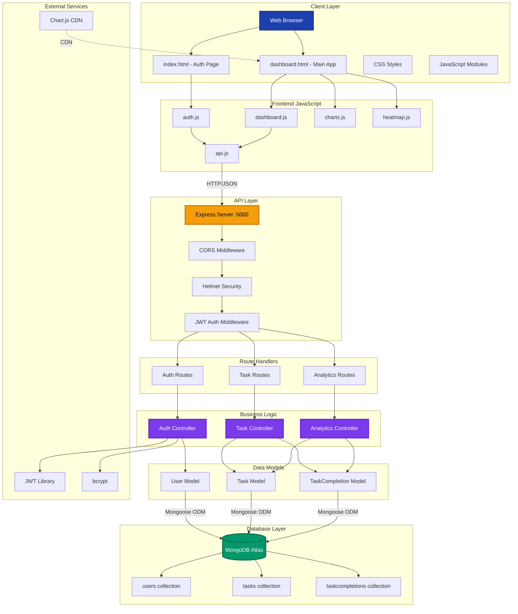
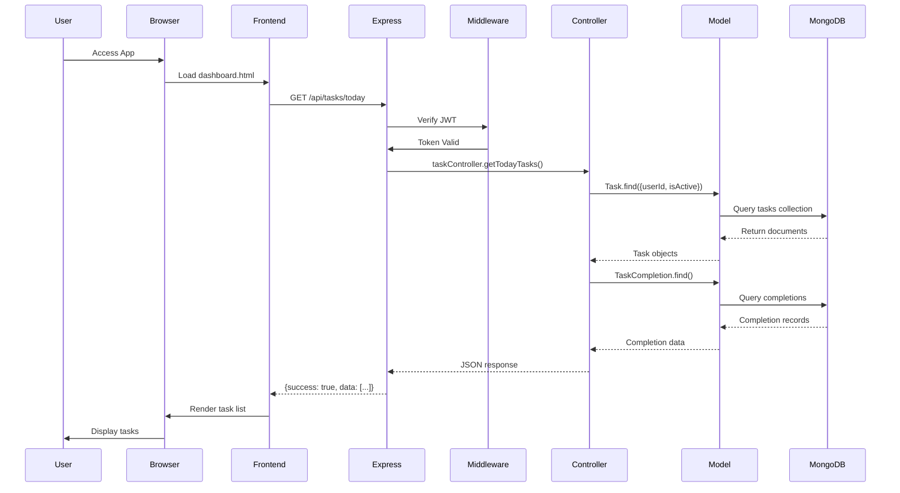
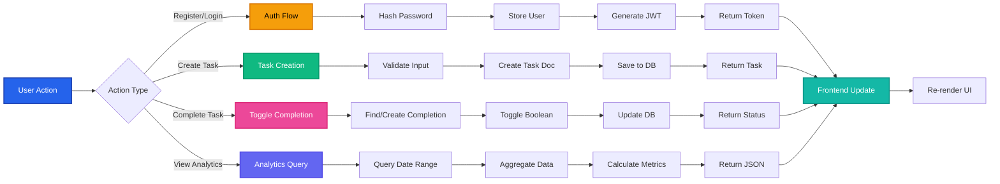
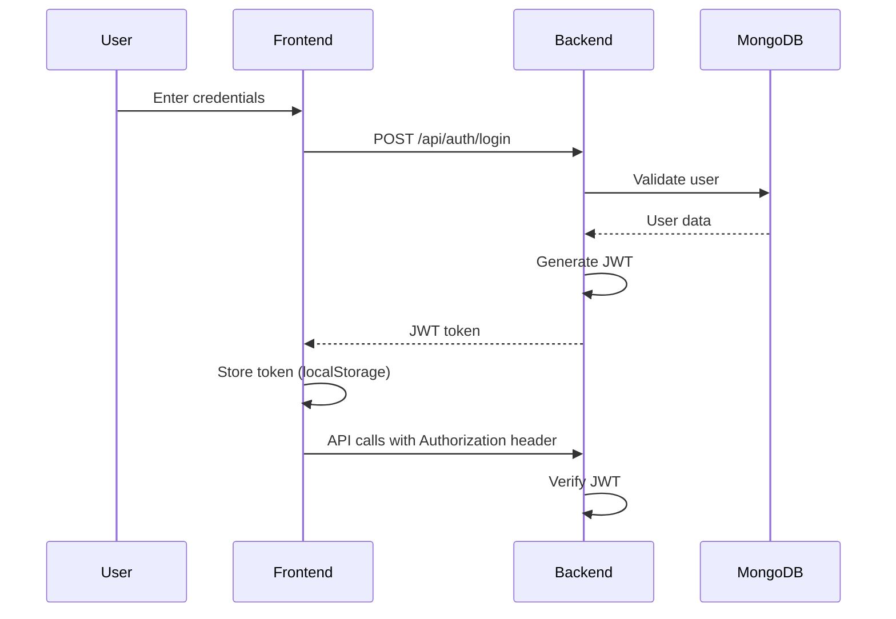
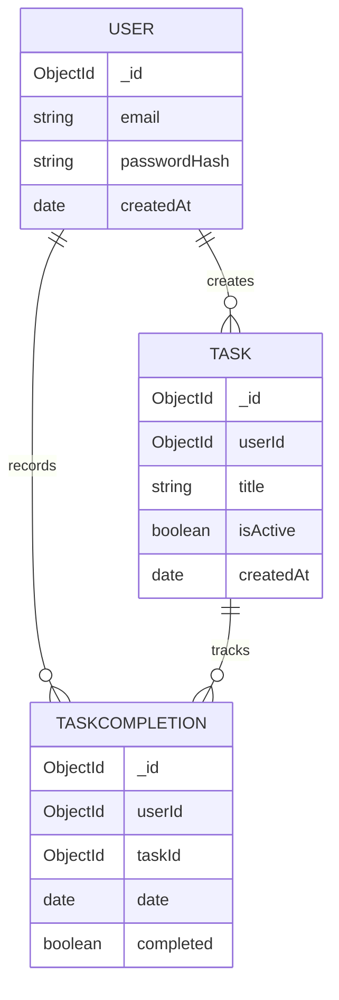

# Habit Rabbit - Master Architecture Document

## 1. Executive Summary
**Habit Rabbit** is a visual habit tracking web application designed to help users build consistent habits through daily tracking and historical progress visualization. The project is optimized for a **24-hour hackathon** with focus on core functionality and visual impact.

**Target Duration**: 24 Hours  
**Complexity**: Medium (Full-stack CRUD + Analytics)  
**Deployment Target**: Heroku/Railway/Vercel  

---

## 2. Tech Stack Selection

### 2.1 Frontend
- **HTML5** - Semantic markup
- **CSS3** - Custom styling (No Bootstrap - Custom Tailwind-like approach)
- **Vanilla JavaScript** - DOM manipulation and API calls
- **Chart.js** - Progress graphs
- **Cal-Heatmap** or custom solution - Heatmap visualization

**Rationale**: Lightweight, fast development, no build tooling overhead for hackathon speed.

### 2.2 Backend
- **Node.js** (v18+) - Runtime environment
- **Express.js** (v4.18+) - Web framework
- **Middleware Stack**:
  - `express.json()` - JSON parsing
  - `cors` - Cross-origin requests
  - `helmet` - Security headers
  - Custom JWT middleware - Authentication

**Rationale**: Minimal setup, fast API development, excellent for rapid prototyping.

### 2.3 Database
- **MongoDB** (Atlas Cloud)
- **Mongoose** - ODM for schema validation

**Rationale**: 
- Flexible schema for evolving features
- Time-based data handling
- Free tier available (MongoDB Atlas)
- No complex migrations needed during hackathon

### 2.4 Authentication
- **JWT (JSON Web Tokens)** - Stateless authentication
- **bcrypt** - Password hashing

### 2.5 Development Tools
- **Postman/Thunder Client** - API testing
- **MongoDB Compass** - Database visualization
- **Live Server** - Frontend development server

---

## 3. System Architecture Overview

### 3.1 High-Level Architecture Diagram



### 3.2 Request Flow Diagram



### 3.3 Data Flow Architecture



---

## 4. Directory Structure

```
habit-rabbit/
│
├── docs/
│   ├── MASTER_ARCHITECTURE.md        # This file
│   ├── HACKATHON_24HR_PLAN.md       # Hour-by-hour execution plan
│   ├── PRD_HACKATHON.md             # Revised PRD for 24hr scope
│   └── specs/
│       ├── API_SPEC.md              # Complete API documentation
│       └── DATABASE_SCHEMA.md       # MongoDB schema design
│
├── backend/
│   ├── server.js                    # Entry point
│   ├── config/
│   │   └── db.js                    # MongoDB connection
│   ├── models/
│   │   ├── User.js                  # User model
│   │   ├── Task.js                  # Task model
│   │   └── TaskCompletion.js        # Daily completion records
│   ├── routes/
│   │   ├── auth.js                  # Auth endpoints
│   │   ├── tasks.js                 # Task CRUD endpoints
│   │   └── analytics.js             # Analytics endpoints
│   ├── middleware/
│   │   └── authMiddleware.js        # JWT verification
│   ├── controllers/
│   │   ├── authController.js
│   │   ├── taskController.js
│   │   └── analyticsController.js
│   └── utils/
│       └── errorHandler.js          # Centralized error handling
│
├── frontend/
│   ├── index.html                   # Landing/Auth page
│   ├── dashboard.html               # Main app interface
│   ├── css/
│   │   ├── global.css               # Base styles
│   │   ├── auth.css                 # Auth page styles
│   │   └── dashboard.css            # Dashboard styles
│   ├── js/
│   │   ├── auth.js                  # Login/Register logic
│   │   ├── dashboard.js             # Main app logic
│   │   ├── api.js                   # API service layer
│   │   ├── charts.js                # Chart.js integration
│   │   └── heatmap.js               # Heatmap rendering
│   └── assets/
│       └── logo.svg                 # Branding (optional)
│
├── .env.example                     # Environment template
├── .gitignore
├── package.json
└── README.md
```

---

## 5. Core Modules & Systems

### 5.1 Authentication System
**Strategy**: JWT-based stateless authentication

**Flow**:


**Security**:
- Passwords hashed with bcrypt (10 rounds)
- JWT expires in 7 days
- Token stored in `localStorage` (acceptable for hackathon)
- Protected routes require valid token

### 5.2 Task Management System
**Core Operations**:
- Create task
- Fetch today's tasks
- Mark task as completed
- Delete task (with history option)

**Daily Reset Logic**:
- No cron jobs needed
- Completion status tied to `date` field
- New day = new TaskCompletion document
- Historical data preserved automatically

### 5.3 Analytics System
**Components**:
1. **Daily Progress Graph**
   - X-axis: Dates
   - Y-axis: Completion percentage
   - Time ranges: 7d, 30d, 6m

2. **Task Heatmap**
   - Calendar grid visualization
   - Color intensity = consistency
   - Individual task tracking

**Calculation Logic**:
- Daily Progress: `(completed / total) × 100`
- Aggregated per date
- Cached on backend for performance

---

## 6. Data Strategy

### 6.1 Schema Approach
**Collections** (3 total):
1. **users** - User accounts
2. **tasks** - Task definitions
3. **taskcompletions** - Daily completion records

**Key Design Decisions**:
- Separate completion records enable history without data loss
- No deletion cascade by default (user chooses)
- Date-based indexing for fast analytics queries

### 6.2 Data Relationships


---

## 7. Security Architecture

### 7.1 API Security
- All `/api/tasks/*` and `/api/analytics/*` routes protected
- JWT verification middleware on protected routes
- User scoping: Each request filtered by `req.user.id`

### 7.2 Environment Variables
**CRITICAL**: Never expose these to frontend

```env
MONGODB_URI=mongodb+srv://...
JWT_SECRET=your-super-secret-key-here
PORT=5000
```

**The "No Leak" Rule**:
- All sensitive logic server-side
- Frontend only stores JWT token
- API calls authenticated via `Authorization: Bearer <token>`

### 7.3 Input Validation
- Email format validation
- Password minimum 6 characters (hackathon-friendly)
- Task title max 100 characters
- Date validation for analytics queries

---

## 8. Deployment Strategy

### 8.1 Backend Deployment
**Options** (Choose one):
1. **Railway** - Recommended (Free tier, auto-deploy)
2. **Render** - Alternative (Free tier)
3. **Heroku** - Classic choice

**Requirements**:
- Node.js 18+ buildpack
- Environment variables configured
- Start command: `node backend/server.js`

### 8.2 Frontend Deployment
**Options**:
1. **Vercel** - Fastest (drag & drop `frontend/` folder)
2. **Netlify** - Alternative
3. **Serve from Express** - Monolithic approach (simpler)

**CORS Configuration**:
```javascript
app.use(cors({
  origin: 'https://your-frontend.vercel.app',
  credentials: true
}));
```

### 8.3 Database Setup
**MongoDB Atlas**:
1. Create free cluster (M0)
2. Add IP whitelist: `0.0.0.0/0` (allow all for hackathon)
3. Create database user
4. Get connection string
5. Add to `.env`

---

## 9. API Architecture

### 9.1 API Structure
**Base URL**: `/api`

**Authentication Endpoints**:
- `POST /api/auth/register` - User registration
- `POST /api/auth/login` - User login

**Task Endpoints**:
- `POST /api/tasks` - Create task
- `GET /api/tasks/today` - Get today's tasks
- `PUT /api/tasks/:id/complete` - Toggle completion
- `DELETE /api/tasks/:id` - Delete task

**Analytics Endpoints**:
- `GET /api/analytics/progress?range=7d` - Daily progress graph
- `GET /api/analytics/heatmap/:taskId` - Task heatmap data

### 9.2 Response Format
**Success**:
```json
{
  "success": true,
  "data": { ... }
}
```

**Error**:
```json
{
  "success": false,
  "error": "Error message"
}
```

---

## 10. UI/UX Strategy

### 10.1 Design Principles
- **Minimalist** - Clean, distraction-free
- **Visual Feedback** - Instant completion animations
- **Mobile-First** - Responsive from the start
- **Color Psychology** - Green for completion, gradients for progress

### 10.2 Custom Styling Approach
**NO BOOTSTRAP** - Custom CSS with utility classes

**Color Scheme**:
```css
:root {
  --primary: #6366f1;      /* Indigo */
  --success: #10b981;      /* Green */
  --background: #f9fafb;   /* Light gray */
  --card: #ffffff;
  --text: #1f2937;
  --border: #e5e7eb;
}
```

**Key UI Components**:
1. Auth page with gradient background
2. Task cards with hover effects
3. Animated checkboxes
4. Smooth progress bar
5. Interactive heatmap

### 10.3 Animation Libraries (Optional)
- **Framer Motion CDN** - For micro-interactions
- **CSS transitions** - For state changes

---

## 11. Performance Considerations

### 11.1 Frontend Optimization
- Debounce API calls (300ms)
- Lazy load analytics section
- Cache chart data locally
- Minimize DOM manipulations

### 11.2 Backend Optimization
- Index MongoDB collections:
  - `userId` on all collections
  - `date` on taskcompletions
- Limit analytics queries (max 6 months)
- Pagination for large datasets (future)

### 11.3 Database Optimization
```javascript
// Mongoose indexes
taskSchema.index({ userId: 1, isActive: 1 });
completionSchema.index({ userId: 1, taskId: 1, date: -1 });
```

---

## 12. Testing Strategy (Minimal)

### 12.1 Manual Testing Checklist
- [ ] Register new user
- [ ] Login with correct credentials
- [ ] Login fails with wrong credentials
- [ ] Create new task
- [ ] Mark task as completed
- [ ] Verify task persists after logout
- [ ] Check daily reset (change system date)
- [ ] View progress graph
- [ ] View heatmap for task
- [ ] Delete task (both options)

### 12.2 API Testing
Use Postman/Thunder Client:
- Test all endpoints
- Verify JWT protection
- Check error responses

---

## 13. Out of Scope (24-Hour Constraints)

### 13.1 NOT Implementing
- ❌ Social features
- ❌ Push notifications
- ❌ Email verification
- ❌ Password reset flow
- ❌ Task categories
- ❌ Habit streaks
- ❌ Data export
- ❌ Unit tests
- ❌ CI/CD pipeline

### 13.2 Post-Hackathon Enhancements
- Streak tracking
- Achievement badges
- Theme customization
- Email notifications
- Task reminders
- Mobile app (React Native)

---

## 14. Risk Mitigation

### 14.1 Common Pitfalls
| Risk | Impact | Mitigation |
|------|--------|-----------|
| MongoDB connection fails | Critical | Use Atlas, test connection early |
| CORS issues | High | Configure properly from start |
| JWT expiration during demo | Medium | Set 7-day expiration |
| Frontend not updating | Medium | Use proper event handlers |
| Date timezone bugs | Low | Use UTC consistently |

### 14.2 Fallback Plans
- **If MongoDB fails**: Switch to JSON file storage (simple array)
- **If analytics too complex**: Skip heatmap, keep graph only
- **If styling takes too long**: Use minimal CSS, focus on functionality

---

## 15. Success Metrics (Hackathon Judging)

### 15.1 Technical Execution
- ✅ Full-stack implementation
- ✅ Working authentication
- ✅ CRUD operations functional
- ✅ Data persistence verified
- ✅ Deployed and accessible

### 15.2 Visual Impact
- ✅ Custom, professional UI (not default styles)
- ✅ Smooth animations
- ✅ Interactive graphs
- ✅ Color-coded heatmap
- ✅ Mobile responsive

### 15.3 Innovation
- ✅ Unique heatmap visualization
- ✅ No daily reset cron (smart date-based approach)
- ✅ Historical data preservation
- ✅ Clean, maintainable code structure

---

## 16. Getting Started

### 16.1 Prerequisites
```bash
# Required installations
- Node.js v18+
- MongoDB Atlas account (free)
- Code editor (VS Code recommended)
- Git
```

### 16.2 Quick Start Commands
```bash
# Clone/Create project
cd habit-rabbit

# Backend setup
cd backend
npm init -y
npm install express mongoose bcryptjs jsonwebtoken cors helmet dotenv

# Create .env file
echo MONGODB_URI=your_connection_string >> .env
echo JWT_SECRET=your_secret_key >> .env
echo PORT=5000 >> .env

# Start backend
node server.js

# Frontend (separate terminal)
cd ../frontend
# Use Live Server extension in VS Code
# Or: npx serve .
```

---

## 17. Completion Checklist

### Hour 0-4: Backend Foundation
- [ ] Project structure created
- [ ] MongoDB connected
- [ ] Models defined
- [ ] Auth endpoints working
- [ ] JWT middleware implemented

### Hour 4-8: Backend Features
- [ ] Task CRUD complete
- [ ] Daily completion logic
- [ ] Analytics endpoints
- [ ] Error handling
- [ ] API tested with Postman

### Hour 8-16: Frontend
- [ ] Auth page styled
- [ ] Dashboard layout
- [ ] Task list rendering
- [ ] Completion toggle
- [ ] API integration
- [ ] Progress graph
- [ ] Basic styling complete

### Hour 16-20: Polish
- [ ] Heatmap visualization
- [ ] Animations added
- [ ] Mobile responsive
- [ ] Loading states
- [ ] Error messages

### Hour 20-24: Deploy & Demo
- [ ] Backend deployed
- [ ] Frontend deployed
- [ ] CORS configured
- [ ] Demo data seeded
- [ ] Presentation prepared

---

## 18. Support Resources

### 18.1 Documentation Links
- [Express.js Docs](https://expressjs.com/)
- [Mongoose Docs](https://mongoosejs.com/)
- [JWT.io](https://jwt.io/)
- [Chart.js Docs](https://www.chartjs.org/)

### 18.2 Reference Implementations
- Auth flow: JWT + bcrypt pattern
- Date handling: JavaScript Date object + MongoDB Date type
- Charts: Chart.js line graph examples

---

## Status
**Document Version**: 1.0 - Hackathon Ready  
**Last Updated**: February 21, 2026  
**Status**: ✅ APPROVED FOR IMPLEMENTATION

This architecture is optimized for rapid development without sacrificing code quality or security fundamentals.
