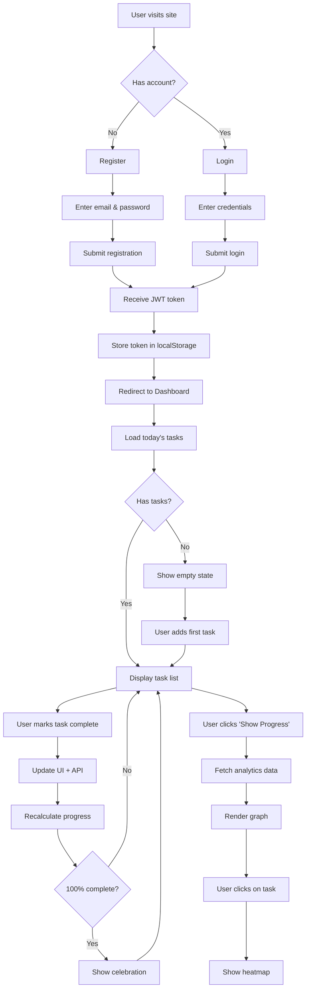

# Habit Rabbit - Product Requirements Document (Hackathon Edition)

## 1. Project Overview

### 1.1 Project Name
**Habit Rabbit** – Visual Habit Tracking and Progress Monitoring Web Application

### 1.2 Tagline
"Build better habits, one day at a time 🐰"

### 1.3 Hackathon Context
- **Duration**: 24 Hours
- **Team Size**: Solo Developer
### **Focus**: Core functionality + Visual impact
- **Target**: Working MVP with impressive visualization

---

## 2. Problem Statement

### The Challenge
Individuals struggle to maintain consistent habits because existing habit-tracking applications:
- Feel repetitive and boring (checkbox fatigue)
- Lack meaningful progress visualization
- Don't preserve historical data effectively
- Overwhelm users with complexity

### The Gap
Users need a **simple, visually engaging** system that:
1. Makes daily habit completion satisfying (instant feedback)
2. Provides clear insights into historical progress (graphs, heatmaps)
3. Maintains long-term data without manual effort
4. Stays clean and distraction-free

---

## 3. Solution

### Core Concept
A web application that combines **daily task tracking** with **visual progress analytics**, using:
- Clean, satisfying UI for daily completion
- Automatic historical data retention
- Visual feedback through graphs and heatmaps
- No complex setup or overwhelming features

### Key Innovation
**Smart Daily Reset**: No cron jobs or scheduled tasks. Completion status is tied to the date field, so historical data is automatically preserved while the UI always shows "today's" tasks.

---

## 4. Target Users

### Primary Audience
1. **College Students** (18-25 years)
   - Building study habits
   - Tracking fitness/health goals
   - Managing daily routines

2. **Young Professionals** (25-35 years)
   - Work-life balance
   - Skill development (learning, reading)
   - Personal improvement

3. **Self-Improvement Enthusiasts** (All ages)
   - Habit formation seekers
   - Quantified-self community
   - Productivity optimizers

### User Persona: "Emma"
- **Age**: 23, Graduate Student
- **Pain Point**: Tried 3+ habit apps, all felt boring after 2 weeks
- **Goal**: See visual proof of consistency to stay motivated
- **Tech Comfort**: High - uses web apps daily
- **Needs**: Simple, beautiful, instant gratification

---

## 5. Core Features (MVP - 24 Hour Scope)

### 5.1 User Authentication
**Description**: Secure account creation and login

**User Stories**:
- As a user, I can create an account with email and password
- As a user, I can log in to access my personal dashboard
- As a user, my data is private and not visible to others

**Acceptance Criteria**:
- [ ] Registration form validates email format
- [ ] Password minimum 6 characters (hackathon-friendly)
- [ ] JWT token issued upon successful login
- [ ] Token persists in localStorage for 7 days
- [ ] Invalid credentials show clear error message

**Technical Notes**:
- bcrypt for password hashing (10 rounds)
- JWT with 7-day expiration
- No email verification (out of scope)

---

### 5.2 Dashboard - Today's Tasks
**Description**: Main screen showing user's habits for the current day

**User Stories**:
- As a user, I can see all my habits when I log in
- As a user, I can quickly identify which habits I've completed today
- As a user, I see my overall progress percentage for today

**Acceptance Criteria**:
- [ ] Dashboard loads within 2 seconds
- [ ] Only today's tasks are displayed (not past days)
- [ ] Completed tasks have distinct visual style
- [ ] Progress bar shows completion percentage
- [ ] Empty state shown if no tasks exist

**UI Requirements**:
- Clean, card-based layout
- Clear visual distinction between completed/incomplete
- Mobile responsive (320px - 1920px)
- Custom styling (NO default Bootstrap appearance)

---

### 5.3 Habit Creation
**Description**: Add new habits to track

**User Stories**:
- As a user, I can create a new habit with a descriptive title
- As a user, my habit appears immediately in today's list
- As a user, I can create multiple habits without page reload

**Acceptance Criteria**:
- [ ] Single input field + "Add" button
- [ ] Title max 100 characters
- [ ] Empty title shows validation error
- [ ] New habit appears instantly in UI
- [ ] New habit syncs to database

**Technical Notes**:
- API call: `POST /api/tasks`
- DOM update before API confirmation (optimistic UI)
- Rollback if API call fails

---

### 5.4 Daily Habit Completion
**Description**: Mark habits as complete/incomplete for today

**User Stories**:
- As a user, I can mark a habit as completed with one click
- As a user, I see immediate visual feedback when completing a habit
- As a user, I can undo completion if I made a mistake
- As a user, my completion is saved even if I close the browser

**Acceptance Criteria**:
- [ ] Checkbox or icon toggle for completion
- [ ] Visual change: color, animation, icon
- [ ] API call updates TaskCompletion record
- [ ] Progress percentage recalculates automatically
- [ ] Completion state persists across sessions

**Visual Requirements**:
- Completion animation (scale, fade, color change)
- Satisfying interaction (haptic feel, even without device support)
- Clear completed vs incomplete states

---

### 5.5 Habit Deletion
**Description**: Remove habits from tracking

**User Stories**:
- As a user, I can delete a habit I no longer want to track
- As a user, I'm asked if I want to keep or delete historical data
- As a user, deleted habits don't appear in my task list

**Acceptance Criteria**:
- [ ] Delete button on each task card
- [ ] Confirmation dialog with two options:
  - "Delete task only" (keep history)
  - "Delete task and history" (remove all records)
- [ ] Task removed from UI immediately
- [ ] Database updated accordingly

**Technical Notes**:
- Option 1: Set `isActive = false` (soft delete)
- Option 2: Delete task + all TaskCompletion records

---

### 5.6 Daily Progress Calculation
**Description**: Real-time calculation of completion percentage

**User Stories**:
- As a user, I see my daily progress percentage update as I complete tasks
- As a user, I feel motivated by watching the percentage increase

**Acceptance Criteria**:
- [ ] Formula: `(completed / total) × 100`
- [ ] Updates in real-time without page refresh
- [ ] Displayed prominently (e.g., "3/5 tasks • 60%")
- [ ] Shows 0% when no tasks completed
- [ ] Shows 100% when all tasks completed (celebration animation)

**Visual Requirements**:
- Progress bar with animated fill
- Percentage text with smooth number transition
- Optional: Celebration confetti at 100%

---

## 6. Extended Features (Post-MVP, Time Permitting)

### 6.1 Historical Progress Graph
**Description**: Line/bar chart showing completion trends over time

**User Stories**:
- As a user, I can view my daily completion percentage for the past week/month
- As a user, I can see patterns in my consistency

**Acceptance Criteria**:
- [ ] Toggle button: "Show Progress"
- [ ] Chart.js line graph
- [ ] Time range selector: 7d, 30d, 6m
- [ ] X-axis: Dates, Y-axis: Percentage
- [ ] Smooth line with gradient fill

**Technical Notes**:
- API: `GET /api/analytics/progress?range=7d`
- Backend aggregates TaskCompletion data
- Returns array: `[{ date, percentage, completed, total }]`

---

### 6.2 Task Heatmap Visualization
**Description**: Calendar-style heatmap showing individual habit consistency

**User Stories**:
- As a user, I can see a heatmap for a specific habit
- As a user, I can identify gaps in my consistency
- As a user, I'm motivated by seeing green-filled calendars

**Acceptance Criteria**:
- [ ] Click on task card to open heatmap
- [ ] Grid layout: weeks × days
- [ ] Color coding: 
  - Gray: No data
  - Light green: Completed
  - Dark green: Consistent streak
- [ ] Covers last 6 months

**Technical Notes**:
- API: `GET /api/analytics/heatmap/:taskId`
- Library option: `cal-heatmap` or custom CSS grid
- Mobile-friendly scrolling

---

## 7. User Flow

---

## 8. Technical Requirements

### 8.1 Performance
- Dashboard load time: < 2 seconds
- API response time: < 500ms
- Smooth animations: 60 FPS
- Responsive on mobile: instant touch feedback

### 8.2 Security
- Passwords hashed (bcrypt, 10 rounds)
- JWT tokens signed with secret key
- All protected routes require authentication
- User data scoped to logged-in user (no cross-user data leaks)
- Input validation on backend

### 8.3 Compatibility
- **Browsers**: Chrome 90+, Firefox 88+, Safari 14+, Edge 90+
- **Devices**: Desktop (1920px), Laptop (1440px), Tablet (768px), Mobile (375px)
- **No IE11 support** (allows modern JavaScript)

### 8.4 Data Integrity
- Daily reset without data loss
- TaskCompletion records never auto-deleted
- User confirmation before permanent deletion
- Graceful handling of API failures

---

## 9. Out of Scope (24-Hour Constraints)

### 9.1 Explicitly NOT Building
- ❌ Social features (friends, sharing, leaderboards)
- ❌ Push notifications
- ❌ Email notifications
- ❌ Password recovery/reset
- ❌ Email verification
- ❌ Third-party integrations (Fitbit, Google Calendar)
- ❌ Task categories/tags
- ❌ Habit streaks (consecutive days)
- ❌ Achievement badges
- ❌ Data export (CSV/PDF)
- ❌ Custom reminders/scheduling
- ❌ Time-of-day tracking
- ❌ Multi-language support
- ❌ Dark mode toggle
- ❌ Offline mode (PWA)
- ❌ Native mobile apps

### 9.2 Rationale
These features, while valuable, would:
- Exceed 24-hour development time
- Add complexity beyond MVP validation needs
- Require additional infrastructure (notification services, etc.)
- Distract from core visual impact

---

## 10. Success Criteria

### 10.1 Functional Success
- [ ] User can register and login
- [ ] User can create tasks
- [ ] User can mark tasks complete
- [ ] Tasks persist across sessions
- [ ] Daily reset works correctly
- [ ] Progress calculation is accurate

### 10.2 Visual Success
- [ ] UI looks modern and custom (not default Bootstrap)
- [ ] Animations are smooth and satisfying
- [ ] Mobile responsive without layout breaks
- [ ] Color scheme is cohesive
- [ ] Judges say "Wow, that's clean!"

### 10.3 Technical Success
- [ ] Code is organized and readable
- [ ] API follows RESTful conventions
- [ ] Database schema is normalized
- [ ] No hardcoded credentials
- [ ] Deployed and accessible online

### 10.4 Hackathon Success
- [ ] Demo runs smoothly without bugs
- [ ] Presentation is clear and compelling
- [ ] Innovation is evident (heatmap visualization)
- [ ] Judges understand the value proposition

---

## 11. User Stories (Complete List)

### Authentication
1. As a **new user**, I want to **register with my email** so that **I can create an account**
2. As a **returning user**, I want to **log in with my credentials** so that **I can access my data**
3. As a **user**, I want to **stay logged in for 7 days** so that **I don't have to log in every time**

### Task Management
4. As a **user**, I want to **add a new habit** so that **I can start tracking it**
5. As a **user**, I want to **see today's tasks** so that **I know what to focus on**
6. As a **user**, I want to **mark a task complete** so that **I can track my progress**
7. As a **user**, I want to **undo completion** so that **I can correct mistakes**
8. As a **user**, I want to **delete a task** so that **I can remove habits I no longer track**

### Progress Tracking
9. As a **user**, I want to **see today's progress percentage** so that **I feel motivated**
10. As a **user**, I want to **view historical progress** so that **I can see my consistency over time**
11. As a **user**, I want to **see a heatmap for each habit** so that **I can identify patterns**

### User Experience
12. As a **user**, I want **instant visual feedback** so that **completing tasks feels satisfying**
13. As a **user**, I want **the app to work on my phone** so that **I can use it anywhere**
14. As a **user**, I want **my data to be private** so that **only I can see it**

---

## 12. Design Principles

### 12.1 Simplicity
- One primary action per screen
- Minimal cognitive load
- No unnecessary options or settings

### 12.2 Visual Feedback
- Every action has a visible consequence
- Animations enhance, not distract
- Color communicates status (green = done, gray = pending)

### 12.3 Motivation
- Progress visualization builds momentum
- Heatmap creates "don't break the chain" effect
- 100% completion feels like an achievement

### 12.4 Reliability
- Data never lost unexpectedly
- Clear error messages
- Offline tolerance (graceful degradation)

---

## 13. Metrics for Future Iteration

### Engagement Metrics (Post-Hackathon)
- Daily active users (DAU)
- Tasks created per user
- Average completion rate
- Days of consecutive use (retention)

### Feature Adoption
- % users viewing progress graph
- % users viewing heatmaps
- Average tasks per user

### Technical Metrics
- API response time (p95, p99)
- Error rate
- Mobile bounce rate

---

## 14. Future Enhancements (Post-Hackathon Roadmap)

### Phase 2: Engagement (Week 2-4)
- Habit streaks (consecutive days)
- Achievement badges
- Email reminders
- Custom habit schedules (3x/week, etc.)

### Phase 3: Social (Month 2)
- Friend connections
- Shared habits
- Leaderboards
- Encouragement messages

### Phase 4: Intelligence (Month 3+)
- AI-powered habit suggestions
- Best time recommendations
- Slump detection & intervention
- Personalized motivation messages

### Phase 5: Ecosystem (Month 6+)
- Mobile app (React Native)
- Wearable integrations (Fitbit, Apple Watch)
- Calendar sync (Google, Outlook)
- Data export & analytics dashboard

---

## 15. Assumptions and Constraints

### Assumptions
- Users have reliable internet connection
- Users prefer visual feedback over text-heavy interfaces
- Users will manually check the app daily (no push notifications initially)
- Email/password auth is sufficient (no need for OAuth initially)

### Constraints
- **Time**: 24 hours total development time
- **Team**: Solo developer
- **Budget**: $0 (free tiers only: MongoDB Atlas, Railway/Vercel)
- **Scope**: MVP only, no premature optimization
- **Tech Stack**: Node.js, Express, MongoDB (as specified)

---

## 16. Risk Assessment

| Risk | Likelihood | Impact | Mitigation |
|------|------------|--------|-----------|
| MongoDB connection fails | Low | High | Test early, have JSON file fallback |
| CORS issues during deployment | Medium | High | Configure CORS from start |
| Chart.js integration difficult | Low | Medium | Have simple percentage fallback |
| Time runs out before deployment | Medium | Critical | Deploy by hour 20, not hour 23 |
| Daily reset logic has bugs | Medium | High | Test with mocked dates early |

---

## 17. Definition of Done

### For Each Feature
- [ ] Code written and tested locally
- [ ] API endpoint tested in Postman
- [ ] Frontend integrated with backend
- [ ] Error handling implemented
- [ ] Mobile responsiveness verified
- [ ] No console errors

### For Entire Project
- [ ] All MVP features complete
- [ ] Deployed to production
- [ ] End-to-end test passed
- [ ] Demo script prepared
- [ ] README written
- [ ] Environment variables secured

---

## 18. Presentation & Demo Script

### Opening (30 seconds)
"Hi, I'm [Name], and I built **Habit Rabbit** – a habit tracker that doesn't just record your tasks, but shows you visual proof of your consistency."

### Problem (30 seconds)
"I've tried 5 different habit apps, and they all get boring after two weeks. Why? Because checking boxes feels meaningless without seeing your progress over time."

### Solution Demo (2 minutes)
1. **Register/Login** (15 sec)
   - "Creating an account is simple – email and password."
   
2. **Add Tasks** (20 sec)
   - "I'll add three habits: Exercise, Read, and Meditate."
   
3. **Complete Tasks** (20 sec)
   - "Watch what happens when I complete a task..." [Click, show animation]
   - "The progress bar updates in real-time."
   
4. **View Analytics** (45 sec)
   - "Click 'Show Progress' to see something cool..."
   - [Graph appears] "This shows my completion percentage over the past week."
   - [Click on task] "And this heatmap shows when I completed 'Exercise' over 6 months."
   - "The green squares create a visual streak that motivates consistency."

### Tech Highlight (30 seconds)
"Built with Node.js, Express, and MongoDB. The clever part: there's no cron job for daily resets. The system uses date-based queries, so your history is automatically preserved while the UI always shows today."

### Closing (15 seconds)
"Habit Rabbit proves that habit tracking can be both simple and visually engaging. Thank you!"

---

**Status**: ✅ PRD Approved for 24-Hour Hackathon  
**Last Updated**: February 21, 2026  
**Version**: 1.0 - Hackathon Edition
