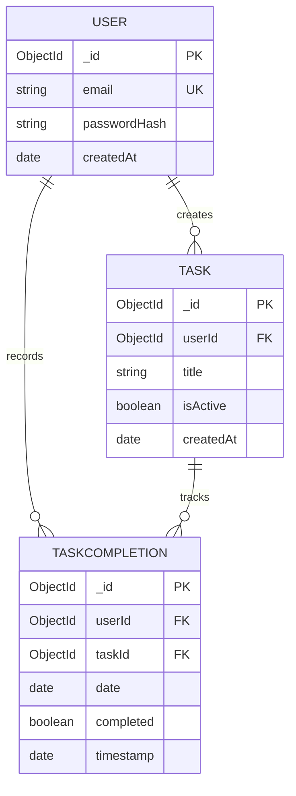

# Habit Rabbit - Database Schema Documentation

## Database Overview

**Database Type**: MongoDB (NoSQL Document Database)  
**ORM/ODM**: Mongoose  
**Hosting**: MongoDB Atlas (Free Tier M0)  

---

## Collections



---

## Collection 1: users

### Purpose
Store user account information and authentication credentials.

### Schema Definition

```javascript
const mongoose = require('mongoose');
const bcrypt = require('bcryptjs');

const userSchema = new mongoose.Schema({
  email: {
    type: String,
    required: [true, 'Email is required'],
    unique: true,
    lowercase: true,
    trim: true,
    validate: {
      validator: function(v) {
        return /^\w+([\.-]?\w+)*@\w+([\.-]?\w+)*(\.\w{2,3})+$/.test(v);
      },
      message: props => `${props.value} is not a valid email`
    }
  },
  passwordHash: {
    type: String,
    required: [true, 'Password is required'],
    minlength: 6
  },
  createdAt: {
    type: Date,
    default: Date.now
  }
});

// Instance method to compare passwords
userSchema.methods.comparePassword = async function(candidatePassword) {
  return await bcrypt.compare(candidatePassword, this.passwordHash);
};

// Pre-save hook to hash password
userSchema.pre('save', async function(next) {
  if (!this.isModified('passwordHash')) return next();
  this.passwordHash = await bcrypt.hash(this.passwordHash, 10);
  next();
});

// Don't return password in JSON responses
userSchema.set('toJSON', {
  transform: function(doc, ret, options) {
    delete ret.passwordHash;
    delete ret.__v;
    return ret;
  }
});

module.exports = mongoose.model('User', userSchema);
```

### Fields

| Field | Type | Required | Unique | Default | Description |
|-------|------|----------|--------|---------|-------------|
| `_id` | ObjectId | Auto | Yes | Auto-generated | MongoDB unique identifier |
| `email` | String | Yes | Yes | - | User's email address (lowercase) |
| `passwordHash` | String | Yes | No | - | bcrypt-hashed password (10 rounds) |
| `createdAt` | Date | No | No | Date.now() | Account creation timestamp |

### Indexes

```javascript
// Unique index on email (automatically created by unique: true)
userSchema.index({ email: 1 }, { unique: true });
```

### Sample Document

```json
{
  "_id": "507f1f77bcf86cd799439011",
  "email": "john.doe@example.com",
  "passwordHash": "$2a$10$EixZaYVK1fsbw1ZfbX3OXe...",
  "createdAt": "2026-02-21T10:30:00.000Z"
}
```

### Usage Examples

```javascript
// Create user
const user = new User({
  email: 'user@example.com',
  passwordHash: 'plainPassword123' // Will be hashed by pre-save hook
});
await user.save();

// Find user by email
const user = await User.findOne({ email: 'user@example.com' });

// Compare password
const isMatch = await user.comparePassword('plainPassword123');

// Get user without password
const userJSON = user.toJSON(); // passwordHash excluded
```

---

## Collection 2: tasks

### Purpose
Store habit/task definitions created by users.

### Schema Definition

```javascript
const mongoose = require('mongoose');

const taskSchema = new mongoose.Schema({
  userId: {
    type: mongoose.Schema.Types.ObjectId,
    ref: 'User',
    required: [true, 'User ID is required'],
    index: true
  },
  title: {
    type: String,
    required: [true, 'Task title is required'],
    trim: true,
    minlength: [1, 'Title must be at least 1 character'],
    maxlength: [100, 'Title cannot exceed 100 characters']
  },
  isActive: {
    type: Boolean,
    default: true,
    index: true
  },
  createdAt: {
    type: Date,
    default: Date.now
  }
});

// Compound index for efficient queries
taskSchema.index({ userId: 1, isActive: 1 });

// Don't return __v
taskSchema.set('toJSON', {
  transform: function(doc, ret, options) {
    delete ret.__v;
    return ret;
  }
});

module.exports = mongoose.model('Task', taskSchema);
```

### Fields

| Field | Type | Required | Indexed | Default | Description |
|-------|------|----------|---------|---------|-------------|
| `_id` | ObjectId | Auto | Yes (PK) | Auto-generated | Task unique identifier |
| `userId` | ObjectId | Yes | Yes | - | Reference to User who owns this task |
| `title` | String | Yes | No | - | Task/habit description (1-100 chars) |
| `isActive` | Boolean | No | Yes | true | Whether task is active (soft delete flag) |
| `createdAt` | Date | No | No | Date.now() | Task creation timestamp |

### Indexes

```javascript
// Single field indexes
taskSchema.index({ userId: 1 });
taskSchema.index({ isActive: 1 });

// Compound index for common query pattern
taskSchema.index({ userId: 1, isActive: 1 });
```

### Sample Document

```json
{
  "_id": "507f1f77bcf86cd799439012",
  "userId": "507f1f77bcf86cd799439011",
  "title": "Exercise for 30 minutes",
  "isActive": true,
  "createdAt": "2026-02-21T10:35:00.000Z"
}
```

### Usage Examples

```javascript
// Create task
const task = new Task({
  userId: req.user.id,
  title: 'Read for 20 minutes'
});
await task.save();

// Get all active tasks for user
const tasks = await Task.find({ 
  userId: req.user.id, 
  isActive: true 
}).sort({ createdAt: -1 });

// Soft delete
await Task.findByIdAndUpdate(taskId, { isActive: false });

// Hard delete
await Task.findByIdAndDelete(taskId);
```

---

## Collection 3: taskcompletions

### Purpose
Record daily completion status for each task. This is the core of the "smart daily reset" strategy.

### Schema Definition

```javascript
const mongoose = require('mongoose');

const taskCompletionSchema = new mongoose.Schema({
  userId: {
    type: mongoose.Schema.Types.ObjectId,
    ref: 'User',
    required: [true, 'User ID is required'],
    index: true
  },
  taskId: {
    type: mongoose.Schema.Types.ObjectId,
    ref: 'Task',
    required: [true, 'Task ID is required'],
    index: true
  },
  date: {
    type: String, // Format: YYYY-MM-DD
    required: [true, 'Date is required'],
    validate: {
      validator: function(v) {
        return /^\d{4}-\d{2}-\d{2}$/.test(v);
      },
      message: props => `${props.value} is not a valid date format (YYYY-MM-DD)`
    },
    index: true
  },
  completed: {
    type: Boolean,
    required: true,
    default: false
  },
  timestamp: {
    type: Date,
    default: Date.now
  }
});

// Compound indexes for efficient queries
taskCompletionSchema.index({ userId: 1, date: -1 });
taskCompletionSchema.index({ userId: 1, taskId: 1, date: -1 });

// Unique constraint: One completion record per user/task/date
taskCompletionSchema.index(
  { userId: 1, taskId: 1, date: 1 }, 
  { unique: true }
);

// Don't return __v
taskCompletionSchema.set('toJSON', {
  transform: function(doc, ret, options) {
    delete ret.__v;
    return ret;
  }
});

module.exports = mongoose.model('TaskCompletion', taskCompletionSchema);
```

### Fields

| Field | Type | Required | Indexed | Default | Description |
|-------|------|----------|---------|---------|-------------|
| `_id` | ObjectId | Auto | Yes (PK) | Auto-generated | Completion record unique identifier |
| `userId` | ObjectId | Yes | Yes | - | Reference to User |
| `taskId` | ObjectId | Yes | Yes | - | Reference to Task |
| `date` | String | Yes | Yes | - | Date in YYYY-MM-DD format |
| `completed` | Boolean | Yes | No | false | Completion status for this date |
| `timestamp` | Date | No | No | Date.now() | When record was created/updated |

### Indexes

```javascript
// Query by user and date range
taskCompletionSchema.index({ userId: 1, date: -1 });

// Query by user, task, and date
taskCompletionSchema.index({ userId: 1, taskId: 1, date: -1 });

// Ensure uniqueness (one record per user/task/date)
taskCompletionSchema.index(
  { userId: 1, taskId: 1, date: 1 }, 
  { unique: true }
);
```

### Sample Document

```json
{
  "_id": "507f1f77bcf86cd799439020",
  "userId": "507f1f77bcf86cd799439011",
  "taskId": "507f1f77bcf86cd799439012",
  "date": "2026-02-21",
  "completed": true,
  "timestamp": "2026-02-21T14:25:00.000Z"
}
```

### Usage Examples

```javascript
// Mark task as completed for today
const today = new Date().toISOString().split('T')[0]; // YYYY-MM-DD

const completion = await TaskCompletion.findOneAndUpdate(
  { userId: req.user.id, taskId, date: today },
  { completed: true, timestamp: Date.now() },
  { upsert: true, new: true } // Create if doesn't exist
);

// Toggle completion
const completion = await TaskCompletion.findOne({
  userId: req.user.id,
  taskId,
  date: today
});

if (completion) {
  completion.completed = !completion.completed;
  completion.timestamp = Date.now();
  await completion.save();
} else {
  await TaskCompletion.create({
    userId: req.user.id,
    taskId,
    date: today,
    completed: true
  });
}

// Get today's completion status for all tasks
const today = new Date().toISOString().split('T')[0];
const completions = await TaskCompletion.find({
  userId: req.user.id,
  date: today
});

// Get completion history for analytics
const completions = await TaskCompletion.find({
  userId: req.user.id,
  date: { $gte: '2026-02-15', $lte: '2026-02-21' }
}).sort({ date: 1 });

// Get heatmap data for specific task
const completions = await TaskCompletion.find({
  userId: req.user.id,
  taskId: '507f1f77bcf86cd799439012',
  date: { $gte: '2025-08-21' }
}).sort({ date: 1 });
```

---

## Database Relationships

### User → Tasks (One-to-Many)
```javascript
// Get all tasks by user
const tasks = await Task.find({ userId: user._id });

// With population (if needed)
const tasks = await Task.find({ userId: user._id }).populate('userId', 'email');
```

### User → TaskCompletions (One-to-Many)
```javascript
// Get all completions by user
const completions = await TaskCompletion.find({ userId: user._id });
```

### Task → TaskCompletions (One-to-Many)
```javascript
// Get all completions for a task
const completions = await TaskCompletion.find({ taskId: task._id });
```

---

## Query Patterns

### 1. Get Today's Tasks with Completion Status

```javascript
async function getTodaysTasks(userId) {
  const today = new Date().toISOString().split('T')[0];
  
  // Get all active tasks
  const tasks = await Task.find({ userId, isActive: true }).lean();
  
  // Get today's completions
  const completions = await TaskCompletion.find({
    userId,
    date: today
  }).lean();
  
  // Map completion status to tasks
  const completionMap = {};
  completions.forEach(c => {
    completionMap[c.taskId.toString()] = c.completed;
  });
  
  // Merge data
  const tasksWithStatus = tasks.map(task => ({
    ...task,
    completed: completionMap[task._id.toString()] || false
  }));
  
  return tasksWithStatus;
}
```

### 2. Calculate Daily Progress

```javascript
async function getDailyProgress(userId, startDate, endDate) {
  // Get all active task IDs
  const tasks = await Task.find({ userId, isActive: true })
    .select('_id')
    .lean();
  const totalTasks = tasks.length;
  
  // Get completions in date range
  const completions = await TaskCompletion.aggregate([
    {
      $match: {
        userId: mongoose.Types.ObjectId(userId),
        date: { $gte: startDate, $lte: endDate }
      }
    },
    {
      $group: {
        _id: '$date',
        completed: { 
          $sum: { $cond: ['$completed', 1, 0] } 
        }
      }
    },
    {
      $sort: { _id: 1 }
    }
  ]);
  
  // Calculate percentages
  return completions.map(day => ({
    date: day._id,
    completed: day.completed,
    total: totalTasks,
    percentage: Math.round((day.completed / totalTasks) * 100)
  }));
}
```

### 3. Generate Heatmap Data

```javascript
async function getTaskHeatmap(userId, taskId, months = 6) {
  const startDate = new Date();
  startDate.setMonth(startDate.getMonth() - months);
  const startDateStr = startDate.toISOString().split('T')[0];
  
  const completions = await TaskCompletion.find({
    userId,
    taskId,
    date: { $gte: startDateStr }
  })
  .select('date completed')
  .sort({ date: 1 })
  .lean();
  
  return completions;
}
```

---

## Data Integrity Rules

### 1. Cascade Delete Strategy

**When deleting a user**:
```javascript
// Delete user and all associated data
const userId = user._id;

await User.findByIdAndDelete(userId);
await Task.deleteMany({ userId });
await TaskCompletion.deleteMany({ userId });
```

**When deleting a task**:
```javascript
// Option 1: Soft delete (preserve history)
await Task.findByIdAndUpdate(taskId, { isActive: false });

// Option 2: Hard delete (remove everything)
await Task.findByIdAndDelete(taskId);
await TaskCompletion.deleteMany({ taskId });
```

### 2. Orphan Prevention

```javascript
// Before deleting a user, check for dependent data
const taskCount = await Task.countDocuments({ userId });
const completionCount = await TaskCompletion.countDocuments({ userId });

console.log(`Deleting user will remove ${taskCount} tasks and ${completionCount} completion records`);
```

### 3. Data Validation

```javascript
// Ensure task belongs to user before allowing operations
const task = await Task.findOne({ _id: taskId, userId: req.user.id });
if (!task) {
  throw new Error('Task not found or access denied');
}
```

---

## Database Connection

### Connection String
```javascript
// .env file
MONGODB_URI=mongodb+srv://<username>:<password>@cluster0.mongodb.net/habitrabbit?retryWrites=true&w=majority
```

### Connection Setup (`config/db.js`)

```javascript
const mongoose = require('mongoose');

const connectDB = async () => {
  try {
    await mongoose.connect(process.env.MONGODB_URI, {
      useNewUrlParser: true,
      useUnifiedTopology: true,
      useCreateIndex: true,
      useFindAndModify: false
    });
    
    console.log('✅ MongoDB Connected');
    
    // Log connection state
    mongoose.connection.on('connected', () => {
      console.log('Mongoose connected to DB');
    });
    
    mongoose.connection.on('error', (err) => {
      console.error('Mongoose connection error:', err);
    });
    
    mongoose.connection.on('disconnected', () => {
      console.log('Mongoose disconnected');
    });
    
  } catch (error) {
    console.error('❌ MongoDB connection failed:', error.message);
    process.exit(1);
  }
};

module.exports = connectDB;
```

### Usage in `server.js`

```javascript
const connectDB = require('./config/db');

// Connect to database
connectDB();

// Start server after DB connection
const PORT = process.env.PORT || 5000;
app.listen(PORT, () => {
  console.log(`🚀 Server running on port ${PORT}`);
});
```

---

## Data Migration & Seeding

### Seed Script (Development Only)

```javascript
// seed.js - For testing and demo purposes
const mongoose = require('mongoose');
const User = require('./models/User');
const Task = require('./models/Task');
const TaskCompletion = require('./models/TaskCompletion');

async function seedDatabase() {
  // Clear existing data
  await User.deleteMany({});
  await Task.deleteMany({});
  await TaskCompletion.deleteMany({});
  
  // Create demo user
  const user = await User.create({
    email: 'demo@habitrabbit.com',
    passwordHash: 'demo123'
  });
  
  // Create demo tasks
  const tasks = await Task.insertMany([
    { userId: user._id, title: 'Exercise for 30 minutes' },
    { userId: user._id, title: 'Read for 20 minutes' },
    { userId: user._id, title: 'Meditate for 10 minutes' },
    { userId: user._id, title: 'Drink 8 glasses of water' },
    { userId: user._id, title: 'Write in journal' }
  ]);
  
  // Create historical completion data (last 30 days)
  const completions = [];
  const today = new Date();
  
  for (let i = 0; i < 30; i++) {
    const date = new Date(today);
    date.setDate(date.getDate() - i);
    const dateStr = date.toISOString().split('T')[0];
    
    tasks.forEach((task, index) => {
      // Random completion (70% chance)
      const completed = Math.random() > 0.3;
      completions.push({
        userId: user._id,
        taskId: task._id,
        date: dateStr,
        completed
      });
    });
  }
  
  await TaskCompletion.insertMany(completions);
  
  console.log('✅ Database seeded successfully');
  console.log(`Created user: ${user.email} / demo123`);
}

// Run seed
require('dotenv').config();
mongoose.connect(process.env.MONGODB_URI)
  .then(() => seedDatabase())
  .then(() => process.exit(0))
  .catch(err => {
    console.error(err);
    process.exit(1);
  });
```

---

## Performance Optimization

### Indexes Summary

```javascript
// Users collection
users.createIndex({ email: 1 }, { unique: true });

// Tasks collection
tasks.createIndex({ userId: 1, isActive: 1 });

// TaskCompletions collection
taskcompletions.createIndex({ userId: 1, date: -1 });
taskcompletions.createIndex({ userId: 1, taskId: 1, date: -1 });
taskcompletions.createIndex(
  { userId: 1, taskId: 1, date: 1 }, 
  { unique: true }
);
```

### Query Optimization Tips

```javascript
// ✅ Good: Use lean() for read-only queries
const tasks = await Task.find({ userId }).lean();

// ❌ Bad: Full Mongoose document when not needed
const tasks = await Task.find({ userId });

// ✅ Good: Select only needed fields
const tasks = await Task.find({ userId }).select('title isActive');

// ✅ Good: Use aggregation for complex calculations
const progress = await TaskCompletion.aggregate([...]);

// ✅ Good: Limit results
const tasks = await Task.find({ userId }).limit(50);
```

---

## Backup & Recovery

### MongoDB Atlas Automatic Backups
- Free tier (M0): No automatic backups
- Paid tiers: Daily snapshots available

### Manual Backup Strategy

```bash
# Export entire database
mongodump --uri="mongodb+srv://..." --out=./backup

# Import backup
mongorestore --uri="mongodb+srv://..." ./backup
```

### Export User Data (for data portability)

```javascript
async function exportUserData(userId) {
  const user = await User.findById(userId).lean();
  const tasks = await Task.find({ userId }).lean();
  const completions = await TaskCompletion.find({ userId }).lean();
  
  return {
    user: { email: user.email },
    tasks,
    completions
  };
}
```

---

## Security Best Practices

### 1. Never Expose Password Hash
```javascript
// Use toJSON transform to exclude passwordHash
userSchema.set('toJSON', {
  transform: function(doc, ret) {
    delete ret.passwordHash;
    return ret;
  }
});
```

### 2. Always Scope Queries by User
```javascript
// ✅ Good: User-scoped
const tasks = await Task.find({ userId: req.user.id });

// ❌ Bad: Not scoped (security risk)
const tasks = await Task.find({});
```

### 3. Validate Input
```javascript
// Use Mongoose validators
title: {
  type: String,
  required: true,
  minlength: 1,
  maxlength: 100
}
```

---

## MongoDB Atlas Setup Guide

### Step 1: Create Account
1. Go to [https://www.mongodb.com/cloud/atlas](https://www.mongodb.com/cloud/atlas)
2. Sign up for free account
3. Verify email

### Step 2: Create Cluster
1. Click "Build a Cluster"
2. Choose "Shared" (Free Tier)
3. Select cloud provider (AWS recommended)
4. Choose region closest to users
5. Name cluster: `habitrabbit`
6. Click "Create Cluster" (takes 5-10 minutes)

### Step 3: Database Access
1. Go to "Database Access"
2. Click "Add New Database User"
3. Username: `habitrabbituser`
4. Password: Auto-generate (save it!)
5. Role: "Read and write to any database"
6. Click "Add User"

### Step 4: Network Access
1. Go to "Network Access"
2. Click "Add IP Address"
3. For development: Click "Allow Access from Anywhere" (0.0.0.0/0)
4. For production: Add specific server IPs

### Step 5: Connect
1. Go to "Clusters" → Click "Connect"
2. Choose "Connect your application"
3. Driver: Node.js, Version: 4.1 or later
4. Copy connection string
5. Replace `<password>` with actual password
6. Add to `.env` file

---

**Database Version**: 1.0  
**MongoDB Server Version**: 5.0+  
**Mongoose Version**: 6.0+  
**Last Updated**: February 21, 2026  
**Status**: ✅ Ready for Implementation
