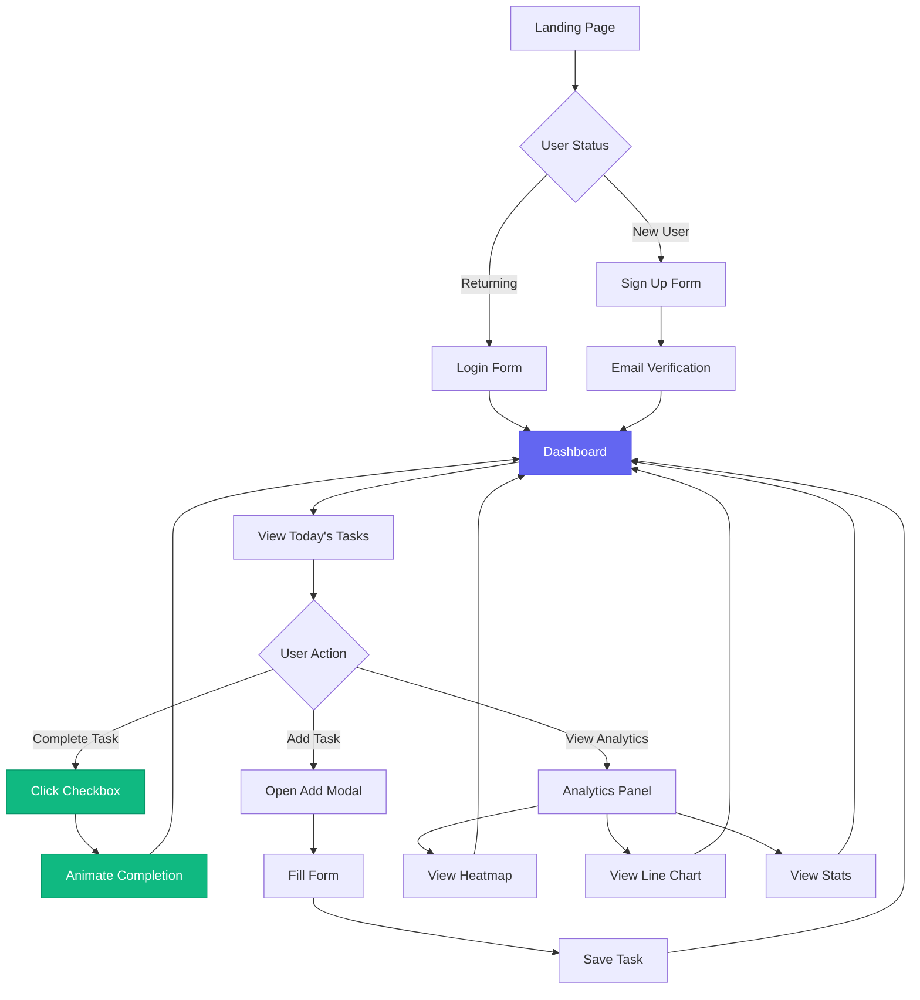
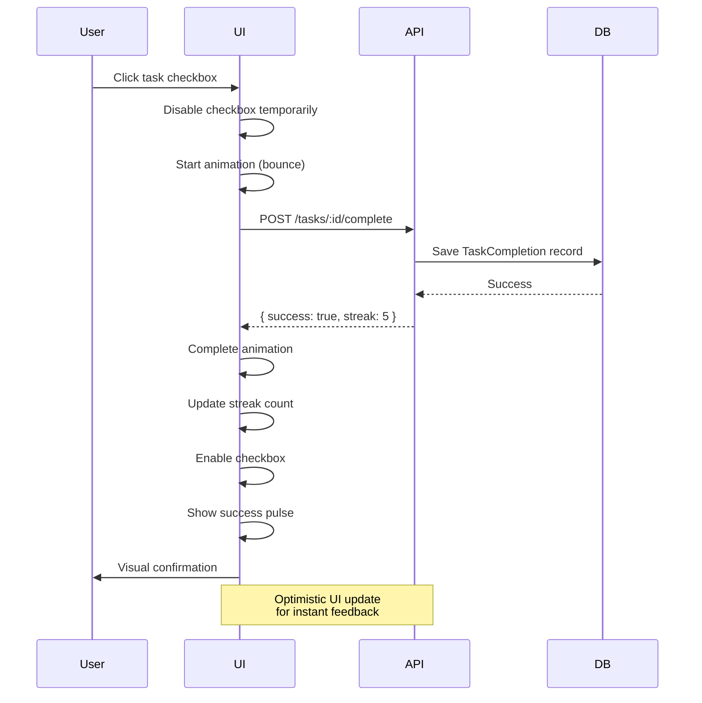
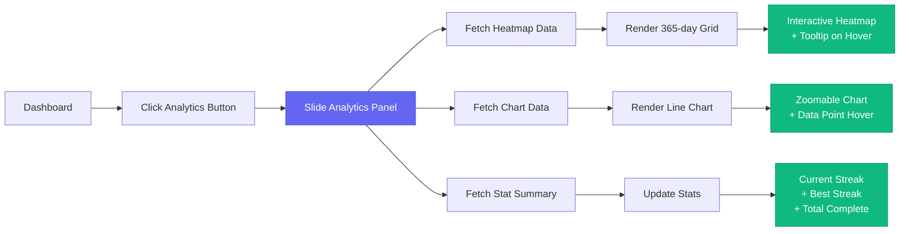

# Habit Rabbit - UI/UX Design Guide

## 1. Design Philosophy

### Core Principles
1. **Minimalist & Focused**: Clean interface prioritizing daily habit completion
2. **Satisfying Interactions**: Every action provides immediate visual feedback
3. **Data Visualization**: Transform numbers into meaningful visual insights
4. **Dark-First Design**: Reduce eye strain for daily habit tracking sessions
5. **Accessibility**: WCAG 2.1 AA compliant for inclusive user experience

### Brand Identity
**Tagline**: "Build better habits, one day at a time 🐰"

**Personality**:
- Friendly & Approachable (Rabbit mascot)
- Motivating but not Overwhelming
- Professional yet Playful
- Data-driven with Visual Appeal

---

## 2. Color System

### Primary Palette

```css
/* Indigo - Primary Actions & Branding */
--primary: #6366f1;           /* Main CTA, Links, Focus states */
--primary-dark: #4f46e5;      /* Hover states, Pressed buttons */
--primary-light: #818cf8;     /* Subtle highlights, Borders */

/* Emerald - Success & Completion */
--secondary: #10b981;         /* Task completion, Success messages */
--secondary-dark: #059669;    /* Hover on completed tasks */
--secondary-light: #34d399;   /* Completion animations */

/* Semantic Colors */
--danger: #ef4444;            /* Delete actions, Error states */
--warning: #f59e0b;           /* Streak warnings, Alerts */
--info: #3b82f6;              /* Informational messages */
```

### Neutral Palette (Dark Theme)

```css
/* Backgrounds */
--bg-dark: #0f172a;           /* Page background (Slate 900) */
--bg-card: #1e293b;           /* Card backgrounds (Slate 800) */
--bg-input: #334155;          /* Input fields (Slate 700) */
--bg-hover: #3f4f66;          /* Hover states (Slate 600) */

/* Text Hierarchy */
--text-primary: #f1f5f9;      /* Headings, Important text */
--text-secondary: #94a3b8;    /* Body text, Labels */
--text-muted: #64748b;        /* Placeholder text, Disabled */
```

### Usage Guidelines

**Do's**:
- Use `--primary` for main CTAs (Add Task, Save, Submit)
- Use `--secondary` for completion indicators and positive actions
- Use `--danger` sparingly for destructive actions only
- Maintain text contrast ratio of at least 4.5:1

**Don'ts**:
- Don't use more than 2 colors in a single component
- Don't use pure white (#ffffff) - use `--text-primary` instead
- Don't use `--danger` for non-destructive actions

---

## 3. Typography

### Font Stack

```css
font-family: 'Inter', -apple-system, BlinkMacSystemFont, 'Segoe UI', sans-serif;
```

**Source**: [Google Fonts - Inter](https://fonts.google.com/specimen/Inter)

**Weights Used**:
- 300 (Light) - Subtle UI elements
- 400 (Regular) - Body text
- 500 (Medium) - Button labels, Emphasized text
- 600 (Semi-Bold) - Subheadings
- 700 (Bold) - Headings, Stats

### Type Scale

```css
/* Headings */
.heading-1 { font-size: 32px; font-weight: 700; line-height: 1.2; }  /* Page titles */
.heading-2 { font-size: 24px; font-weight: 700; line-height: 1.3; }  /* Section headers */
.heading-3 { font-size: 20px; font-weight: 600; line-height: 1.4; }  /* Card titles */
.heading-4 { font-size: 18px; font-weight: 600; line-height: 1.4; }  /* Subsections */

/* Body Text */
.body-large { font-size: 16px; font-weight: 400; line-height: 1.6; } /* Main content */
.body-base { font-size: 14px; font-weight: 400; line-height: 1.6; }  /* Standard text */
.body-small { font-size: 13px; font-weight: 400; line-height: 1.5; } /* Labels */
.body-tiny { font-size: 12px; font-weight: 400; line-height: 1.4; }  /* Captions */

/* Stats & Numbers */
.stat-value { font-size: 28px; font-weight: 700; line-height: 1; }   /* Dashboard stats */
```

### Accessibility Notes
- Minimum font size: 12px for body text
- Use relative units (rem/em) when possible
- Ensure sufficient line spacing (1.5x for body text)

---

## 4. Component Library

### 4.1 Buttons

#### Primary Button
```html
<button class="btn btn-primary">
  <span class="btn-icon">✨</span>
  <span class="btn-text">Add Habit</span>
</button>
```

**States**:
- `Default`: background: var(--primary), smooth shadow
- `Hover`: background: var(--primary-dark), lift effect (transform: translateY(-2px))
- `Active/Pressed`: scale(0.98), deeper shadow
- `Disabled`: opacity: 0.5, cursor: not-allowed

#### Secondary Button
```html
<button class="btn btn-secondary">
  <span class="btn-icon">📊</span>
  <span class="btn-text">Analytics</span>
</button>
```

#### Ghost Button
```html
<button class="btn btn-ghost">Logout</button>
```

**Sizing**:
- `.btn-sm`: padding: 8px 16px, font-size: 13px
- `.btn-md`: padding: 12px 24px, font-size: 14px (default)
- `.btn-lg`: padding: 16px 32px, font-size: 16px

---

### 4.2 Task Cards

#### Structure
```html
<div class="task-card">
  <div class="task-checkbox">
    <input type="checkbox" id="task-1">
    <label for="task-1">
      <span class="checkbox-mark"></span>
    </label>
  </div>
  <div class="task-content">
    <h3 class="task-title">Morning Exercise</h3>
    <p class="task-description">30 minutes workout</p>
  </div>
  <div class="task-actions">
    <button class="btn-icon" aria-label="Delete task">🗑️</button>
  </div>
</div>
```

**Visual Behavior**:
1. **Unchecked State**: 
   - Border: 2px solid var(--bg-input)
   - Background: var(--bg-card)
   
2. **Hover State**:
   - Border: 2px solid var(--primary-light)
   - Background: var(--bg-hover)
   - Cursor: pointer

3. **Checked State**:
   - Border: 2px solid var(--secondary)
   - Background: rgba(16, 185, 129, 0.1) (green tint)
   - Text: line-through with var(--text-muted)
   - Checkbox: Animated checkmark with bounce effect

4. **Animation Timeline**:
   - Checkbox click → Checkmark appears (0.2s)
   - Card border color transition (0.3s)
   - Background tint fade-in (0.3s)
   - Text strikethrough animation (0.2s delay)

---

### 4.3 Input Fields

```html
<div class="input-group">
  <label for="habit-name" class="input-label">Habit Name</label>
  <input 
    type="text" 
    id="habit-name" 
    class="input-field" 
    placeholder="e.g., Morning Exercise"
  >
  <span class="input-error">This field is required</span>
</div>
```

**States**:
- `Default`: background: var(--bg-input), border: 2px solid transparent
- `Focus`: border: 2px solid var(--primary), outline: none
- `Error`: border: 2px solid var(--danger)
- `Disabled`: opacity: 0.6, cursor: not-allowed

**Autofocus Behavior**: 
- First input auto-focused on modal open
- Focus ring always visible (accessibility)

---

### 4.4 Stat Cards

```html
<div class="stat-card">
  <span class="stat-icon">🎯</span>
  <div class="stat-info">
    <span class="stat-value">85%</span>
    <span class="stat-label">Today</span>
  </div>
</div>
```

**Visual Hierarchy**:
- Icon: 32px, aligned top-left
- Value: 28px bold, var(--text-primary)
- Label: 13px, var(--text-secondary)

**Grid Layout**: 3 stats in a row on desktop, stack on mobile

---

### 4.5 Modals

```html
<div class="modal-overlay">
  <div class="modal">
    <div class="modal-header">
      <h2 class="modal-title">Add New Habit</h2>
      <button class="modal-close" aria-label="Close">×</button>
    </div>
    <div class="modal-body">
      <!-- Form content -->
    </div>
    <div class="modal-footer">
      <button class="btn btn-ghost">Cancel</button>
      <button class="btn btn-primary">Save Habit</button>
    </div>
  </div>
</div>
```

**Animation**:
- Overlay: fade-in (0.2s)
- Modal: scale(0.9) → scale(1) + fade-in (0.3s ease-out)
- Close: scale(1) → scale(0.9) + fade-out (0.2s)

**Accessibility**:
- Focus trap when open
- Esc key to close
- Click overlay to close
- Restore focus on close

---

## 5. Animation & Interactions

### Design Principles
1. **Purpose-Driven**: Every animation reinforces user action
2. **Snappy**: Short durations (200-300ms) for responsiveness
3. **Natural**: Use ease-out for entrances, ease-in for exits
4. **Reduced Motion**: Respect prefers-reduced-motion media query

### Animation Library

#### Micro-Interactions

```css
/* Button Lift */
.btn:hover {
  transform: translateY(-2px);
  box-shadow: 0 6px 20px rgba(99, 102, 241, 0.4);
  transition: all 0.2s ease-out;
}

/* Checkbox Bounce */
@keyframes checkbounce {
  0%, 100% { transform: scale(1); }
  50% { transform: scale(1.2); }
}

.checkbox-mark:checked {
  animation: checkbounce 0.3s ease-in-out;
}

/* Card Pulse (on completion) */
@keyframes pulse-success {
  0% { box-shadow: 0 0 0 0 rgba(16, 185, 129, 0.7); }
  70% { box-shadow: 0 0 0 10px rgba(16, 185, 129, 0); }
  100% { box-shadow: 0 0 0 0 rgba(16, 185, 129, 0); }
}

.task-card.completed {
  animation: pulse-success 0.6s ease-out;
}
```

#### Page Transitions

```css
/* Fade In */
.fade-in {
  animation: fadeIn 0.4s ease-out;
}

@keyframes fadeIn {
  from { opacity: 0; }
  to { opacity: 1; }
}

/* Slide Up */
.slide-up {
  animation: slideUp 0.3s ease-out;
}

@keyframes slideUp {
  from { 
    opacity: 0;
    transform: translateY(20px);
  }
  to { 
    opacity: 1;
    transform: translateY(0);
  }
}
```

#### Loading States

```css
/* Bounce Animation (Rabbit Icon) */
@keyframes bounce {
  0%, 100% { transform: translateY(0); }
  50% { transform: translateY(-10px); }
}

.loader-icon {
  animation: bounce 1s ease-in-out infinite;
}

/* Skeleton Loader */
.skeleton {
  background: linear-gradient(
    90deg,
    var(--bg-card) 25%,
    var(--bg-hover) 50%,
    var(--bg-card) 75%
  );
  background-size: 200% 100%;
  animation: loading 1.5s ease-in-out infinite;
}

@keyframes loading {
  0% { background-position: 200% 0; }
  100% { background-position: -200% 0; }
}
```

### Reduced Motion Support

```css
@media (prefers-reduced-motion: reduce) {
  *,
  *::before,
  *::after {
    animation-duration: 0.01ms !important;
    animation-iteration-count: 1 !important;
    transition-duration: 0.01ms !important;
  }
}
```

---

## 6. Layout Patterns

### Container System

```css
/* Max-width constraints for readability */
.container-sm { max-width: 600px; margin: 0 auto; }  /* Forms, modals */
.container-md { max-width: 800px; margin: 0 auto; }  /* Dashboard */
.container-lg { max-width: 1200px; margin: 0 auto; } /* Analytics */
```

### Responsive Grid

```css
/* Task Grid */
.task-grid {
  display: grid;
  gap: 16px;
  grid-template-columns: 1fr;
}

/* Stats Grid */
.stats-bar {
  display: grid;
  gap: 16px;
  grid-template-columns: repeat(auto-fit, minmax(200px, 1fr));
}
```

### Spacing Scale

```css
--spacing-xs: 4px;    /* Tight spacing, icon gaps */
--spacing-sm: 8px;    /* Input padding, button gap */
--spacing-md: 16px;   /* Card padding, section gaps */
--spacing-lg: 24px;   /* Section padding */
--spacing-xl: 32px;   /* Page padding */
--spacing-2xl: 48px;  /* Major section dividers */
```

**Usage Rule**: Use multiples of 4px or 8px for all spacing

---

## 7. Data Visualization

### 7.1 Heatmap (Completion Calendar)

**Visual Requirements**:
- Cell size: 14px × 14px (desktop), 10px × 10px (mobile)
- Gap: 3px between cells
- Weeks displayed: Last 52 weeks (1 year)

**Color Scale**:
```css
/* Completion Intensity */
.cell-0 { background: var(--bg-input); }          /* No tasks completed */
.cell-25 { background: rgba(16, 185, 129, 0.3); } /* 1-25% complete */
.cell-50 { background: rgba(16, 185, 129, 0.5); } /* 26-50% complete */
.cell-75 { background: rgba(16, 185, 129, 0.7); } /* 51-75% complete */
.cell-100 { background: var(--secondary); }        /* 76-100% complete */
```

**Interaction**:
- Hover: Show tooltip with date + completion percentage
- Tooltip: Dark background, 200ms delay, pointer-events: none

---

### 7.2 Line Chart (Streak Progress)

**Library**: Chart.js

**Configuration**:
```javascript
{
  type: 'line',
  data: {
    labels: ['Mon', 'Tue', 'Wed', 'Thu', 'Fri', 'Sat', 'Sun'],
    datasets: [{
      label: 'Completion Rate',
      data: [80, 90, 75, 100, 85, 70, 95],
      borderColor: '#6366f1',
      backgroundColor: 'rgba(99, 102, 241, 0.1)',
      borderWidth: 3,
      tension: 0.4, // Smooth curves
      fill: true,
      pointRadius: 5,
      pointHoverRadius: 7,
      pointBackgroundColor: '#6366f1',
      pointBorderColor: '#fff',
      pointBorderWidth: 2
    }]
  },
  options: {
    responsive: true,
    maintainAspectRatio: true,
    plugins: {
      legend: { display: false },
      tooltip: {
        backgroundColor: 'rgba(30, 41, 59, 0.95)',
        titleColor: '#f1f5f9',
        bodyColor: '#94a3b8',
        padding: 12,
        cornerRadius: 8
      }
    },
    scales: {
      y: {
        beginAtZero: true,
        max: 100,
        ticks: { 
          color: '#64748b',
          callback: value => value + '%'
        },
        grid: { color: 'rgba(255, 255, 255, 0.05)' }
      },
      x: {
        ticks: { color: '#64748b' },
        grid: { display: false }
      }
    }
  }
}
```

---

### 7.3 Progress Rings/Bars

**Circular Progress (Stats)**:
```html
<svg class="progress-ring" viewBox="0 0 100 100">
  <circle class="progress-ring-bg" cx="50" cy="50" r="45"></circle>
  <circle class="progress-ring-fill" cx="50" cy="50" r="45" 
          style="stroke-dashoffset: calc(283 - (283 * 85) / 100)"></circle>
  <text x="50" y="50" class="progress-text">85%</text>
</svg>
```

**Linear Progress Bar**:
```html
<div class="progress-bar">
  <div class="progress-fill" style="width: 85%"></div>
</div>
```

---

## 8. Iconography

### Icon System

**Source**: Emoji-based system for speed + visual consistency

```javascript
const ICON_MAP = {
  // App Icons
  brand: '🐰',
  loading: '🐰',
  
  // Actions
  add: '➕',
  edit: '✏️',
  delete: '🗑️',
  save: '💾',
  cancel: '❌',
  
  // Navigation
  dashboard: '🏠',
  analytics: '📊',
  settings: '⚙️',
  logout: '👋',
  
  // Status
  success: '✅',
  error: '❌',
  warning: '⚠️',
  info: 'ℹ️',
  
  // Habits
  target: '🎯',
  fire: '🔥',       // Streak
  calendar: '📅',
  check: '✓',
  star: '⭐'
};
```

**Usage Guidelines**:
- Size: 20-24px for UI icons, 32-48px for decorative
- Alignment: Vertically centered with text
- Spacing: 8px gap between icon and label
- Fallback: Provide aria-label for screen readers

---

## 9. Accessibility Standards

### WCAG 2.1 AA Compliance

#### Color Contrast
- **Large text (18px+)**: Minimum 3:1
- **Normal text**: Minimum 4.5:1
- **Interactive elements**: Minimum 3:1 against background

**Testing Tools**:
- Chrome DevTools Color Picker
- WebAIM Contrast Checker
- axe DevTools Extension

#### Keyboard Navigation

**Tab Order**:
1. Header navigation (Analytics, Logout)
2. Add Task button
3. Task checkboxes (top to bottom)
4. Task action buttons
5. Footer links

**Focus Indicators**:
```css
*:focus-visible {
  outline: 2px solid var(--primary);
  outline-offset: 2px;
  border-radius: var(--border-radius-xs);
}
```

**Shortcuts**:
- `Esc`: Close modal/dropdown
- `Enter`: Submit form
- `Space`: Toggle checkbox
- `Tab`: Next element
- `Shift+Tab`: Previous element

#### Screen Reader Support

**Required Attributes**:
```html
<!-- Buttons with icons only -->
<button aria-label="Delete task">🗑️</button>

<!-- Loading states -->
<div role="status" aria-live="polite" aria-busy="true">
  Loading habits...
</div>

<!-- Checkboxes -->
<input 
  type="checkbox" 
  id="task-1"
  aria-checked="false"
  aria-label="Mark Morning Exercise as complete"
>

<!-- Modals -->
<div role="dialog" aria-modal="true" aria-labelledby="modal-title">
  <h2 id="modal-title">Add New Habit</h2>
</div>
```

#### Error Handling

**Form Validation**:
```html
<input 
  type="text"
  id="habit-name"
  aria-invalid="true"
  aria-describedby="habit-name-error"
>
<span id="habit-name-error" class="input-error" role="alert">
  Habit name is required
</span>
```

---

## 10. Responsive Design

### Breakpoint System

```css
/* Mobile First Approach */
:root {
  --breakpoint-sm: 640px;   /* Large phones */
  --breakpoint-md: 768px;   /* Tablets */
  --breakpoint-lg: 1024px;  /* Laptops */
  --breakpoint-xl: 1280px;  /* Desktops */
}

/* Usage */
@media (max-width: 768px) {
  .header-content {
    flex-direction: column;
    gap: 16px;
  }
  
  .stats-bar {
    grid-template-columns: 1fr;
  }
  
  .btn-text {
    display: none; /* Show icons only on mobile */
  }
}
```

### Mobile Optimizations

1. **Touch Targets**: Minimum 44px × 44px (WCAG guideline)
2. **Font Scaling**: Respect user's device text size preferences
3. **Input Types**: Use `type="email"`, `type="number"` for native keyboards
4. **Viewport**: `<meta name="viewport" content="width=device-width, initial-scale=1">`

---

## 11. User Flow Diagrams

### Primary User Journey



### Task Completion Flow



### Analytics View Flow



---

## 12. Design Resources & Inspiration

### Component References

**High-Quality UI Libraries**:
1. **[21st.dev](https://21st.dev/)** - Modern React component gallery
   - Use for: Card layouts, Button variations, Form patterns
   
2. **[UIVerse](https://uiverse.io/)** - CSS/Tailwind components
   - Use for: Loaders, Checkboxes, Toggle switches
   
3. **[Landingfolio](https://www.landingfolio.com/)** - Landing page inspiration
   - Use for: Hero sections, CTA placements
   
4. **[Land-book](https://land-book.com/)** - Website design inspiration
   - Use for: Overall layout ideas, Color schemes

### Animation Libraries (Optional Enhancement)

- **Framer Motion**: For advanced React animations
- **GSAP**: For complex timeline animations
- **Lottie**: For illustrated micro-interactions

### Icon Systems (If expanding beyond emoji)

- **Lucide Icons**: Clean, consistent SVG icons
- **Heroicons**: Tailwind-designed icon set
- **Phosphor Icons**: Flexible icon family

---

## 13. Implementation Checklist

### Phase 1: Foundation ✅
- [x] Set up CSS custom properties (color, typography, spacing)
- [x] Implement base component styles (buttons, inputs, cards)
- [x] Add loading states and transitions
- [x] Ensure dark theme consistency

### Phase 2: Interactions 🔄
- [ ] Add micro-animations (button hover, checkbox bounce)
- [ ] Implement task completion animation sequence
- [ ] Add modal entrance/exit transitions
- [ ] Add skeleton loaders for async data

### Phase 3: Data Visualization 📊
- [ ] Integrate Chart.js with custom theme
- [ ] Build heatmap component (365-day grid)
- [ ] Add interactive tooltips
- [ ] Ensure chart responsiveness

### Phase 4: Accessibility ♿
- [ ] Add ARIA labels to all interactive elements
- [ ] Implement focus management (modals, forms)
- [ ] Test keyboard navigation flow
- [ ] Add prefers-reduced-motion support
- [ ] Verify color contrast ratios

### Phase 5: Polish ✨
- [ ] Add error state animations
- [ ] Implement success toast notifications
- [ ] Fine-tune animation timings
- [ ] Test on mobile devices
- [ ] Cross-browser testing (Chrome, Firefox, Safari)

---

## 14. Performance Guidelines

### Critical Rendering Path

1. **Inline Critical CSS**: Above-the-fold styles in `<head>`
2. **Defer Non-Critical Scripts**: Use `defer` attribute
3. **Lazy Load Images**: Use `loading="lazy"`
4. **Font Loading Strategy**:
   ```css
   font-display: swap; /* Show fallback immediately */
   ```

### Animation Performance

**Use GPU-accelerated properties only**:
- ✅ `transform` (translate, scale, rotate)
- ✅ `opacity`
- ❌ `width`, `height`, `top`, `left` (causes reflow)

**Example**:
```css
/* Bad - causes reflow */
.slide-in {
  left: -100px;
  transition: left 0.3s;
}

/* Good - GPU accelerated */
.slide-in {
  transform: translateX(-100px);
  transition: transform 0.3s;
}
```

### Image Optimization

- Use WebP format with PNG/JPG fallback
- Compress images before deployment (TinyPNG, Squoosh)
- Use appropriate dimensions (no 2000px images for 200px display)

---

## 15. Testing Protocol

### Visual Regression Testing

**Manual Checklist**:
1. Test all button states (default, hover, active, disabled)
2. Verify task card states (unchecked, hover, checked, loading)
3. Check modal animations (open, close, overlay click)
4. Validate form input states (default, focus, error, disabled)
5. Review responsive breakpoints (mobile, tablet, desktop)

### Browser Compatibility

**Target Support**:
- Chrome/Edge 90+ ✅
- Firefox 88+ ✅
- Safari 14+ ✅
- Mobile browsers (iOS Safari, Chrome Mobile) ✅

**Testing Tools**:
- BrowserStack (cross-browser testing)
- Chrome DevTools Device Mode (responsive testing)
- Lighthouse (performance audit)

### Accessibility Audit

**Tools**:
1. **axe DevTools**: Automated accessibility scanning
2. **WAVE**: Web accessibility evaluation
3. **Keyboard Navigation**: Manual tab-through test
4. **Screen Reader**: Test with NVDA (Windows) or VoiceOver (Mac)

---

## 16. Future Enhancements

### Version 2.0 Ideas

1. **Custom Themes**: Allow users to choose color schemes
2. **Animated Mascot**: Rabbit character with state-based expressions
3. **Dark/Light Mode Toggle**: Add light theme support
4. **Haptic Feedback**: For mobile task completion
5. **Sound Effects**: Optional audio cues for completions
6. **Achievement Badges**: Visual rewards for milestones
7. **Neumorphism Components**: Soft UI alternative style
8. **3D Task Cards**: Perspective transforms on hover

### Advanced Animations

```css
/* Parallax scroll effect */
.hero-section {
  background-attachment: fixed;
}

/* Glassmorphism effect */
.glass-card {
  background: rgba(30, 41, 59, 0.4);
  backdrop-filter: blur(10px);
  border: 1px solid rgba(255, 255, 255, 0.1);
}

/* Text gradient */
.gradient-text {
  background: linear-gradient(135deg, #6366f1 0%, #10b981 100%);
  -webkit-background-clip: text;
  -webkit-text-fill-color: transparent;
}
```

---

## 17. Brand Assets

### Logo Variations

**Primary Logo**:
```
🐰 Habit Rabbit
```

**Compact Logo** (Mobile/Favicon):
```
🐰
```

**Text-Only**:
```
HABIT RABBIT
```

### Color Export (Design Tools)

**Figma/Sketch Palette**:
```
Primary: #6366f1
Secondary: #10b981
Danger: #ef4444
Warning: #f59e0b
BG Dark: #0f172a
BG Card: #1e293b
Text Primary: #f1f5f9
Text Secondary: #94a3b8
```

---

## 18. Quick Reference

### Common Patterns

```css
/* Card with hover effect */
.card {
  background: var(--bg-card);
  border-radius: var(--border-radius);
  padding: var(--spacing-lg);
  transition: var(--transition);
  cursor: pointer;
}

.card:hover {
  transform: translateY(-4px);
  box-shadow: var(--shadow);
}

/* Flex centering */
.center {
  display: flex;
  align-items: center;
  justify-content: center;
}

/* Visually hidden (accessible) */
.sr-only {
  position: absolute;
  width: 1px;
  height: 1px;
  padding: 0;
  margin: -1px;
  overflow: hidden;
  clip: rect(0, 0, 0, 0);
  white-space: nowrap;
  border-width: 0;
}

/* Truncate text */
.truncate {
  overflow: hidden;
  text-overflow: ellipsis;
  white-space: nowrap;
}
```

---

## Conclusion

This UI/UX guide serves as the single source of truth for all design decisions in Habit Rabbit. By following these standards, we ensure:

✅ **Visual Consistency** across all pages and components  
✅ **Delightful Interactions** that reinforce user actions  
✅ **Accessibility** for users of all abilities  
✅ **Performance** through optimized animations and rendering  
✅ **Scalability** for future feature additions  

**Remember**: Every design decision should prioritize the user's goal — building consistent habits with minimal friction and maximum satisfaction.

---

**Document Version**: 1.0  
**Last Updated**: February 21, 2026  
**Maintained By**: Habit Rabbit Team  
**License**: Internal Use Only
